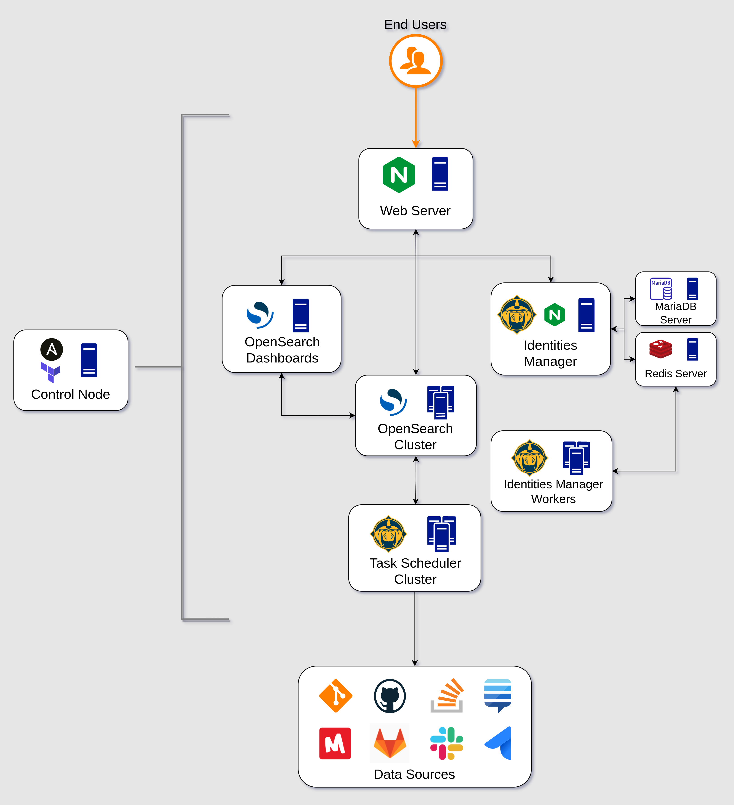

# Architecture Overview

[Bitergia Analytics Platform](https://github.com/bitergia-analytics/) fetches,
stores, and analyzes data from software development repositories or platforms.
Data is processed in several ways to produce metrics such as the evolution over
time of activity, people, or organizations; time to respond on issues and pull
requests; diversity; BMI; elephant factor; onion model analysis, among others.

The platform is built on top of [GrimoireLab](https://chaoss.github.io/grimoirelab/),
an open source project developed in Python and JavaScript, that provides the core
components to fetch and analyze data. Data visualizations and storage are provided
by [OpenSearch](https://opensearch.org/).

The platform is deployed as a set of components. The diagram below shows how they
interact with each other. By default, each component is deployed in different VMs
but there is an option to deploy all components **on a single VM**. See these sections
of [opentofu](/docs/provision.md#deploy-all-bap-services-in-a-single-vm-opcional) and [ansible](/docs/deployment_and_config.md#deploy-all-bap-services-in-a-single-vm-optional). These components are:

* **Control node**: its aim is to create the infrastructure and to provision the
  machines. It creates the other nodes using Google Cloud Platform APIs via
  OpenTofu. Then, it runs Ansible to provision and launch the services,
  via SSH.
* **Task Scheduler cluster**: it collects data from different `Data Sources`
  and schedules the work to feed all the databases with the enriched
  information. There's a node per each tenant. The cluster runs the GrimoireLab's
  component called
  [Mordred](https://github.com/chaoss/grimoirelab-sirmordred).
* **Identities Manager**: service to store and group in form of individuals,
  the identities the platform retrieves from the different `Data Sources`.
  This is provided by the GrimoireLab's component called
  [SortingHat](https://github.com/chaoss/grimoirelab-sortinghat).
  Long-running tasks, such as recommendations of which identities are the
  same, execute in a cluster of **workers**.
* **OpenSearch cluster**: A set of nodes that offers a OpenSearch service,
  offering high availability and fault tolerance. Data can be queried by
  end users.
  * **Manager Nodes**: Responsible for cluster management, maintaining cluster state,
  coordinating operations, and shard allocation. They should not store data or participate
  in ingestion or search directly. An odd number of manager nodes (generally 3) is
  recommended for fault tolerance and to prevent "split-brain".
  * **Data Nodes**: Responsible for storing indexed data and executing search and
  analysis operations. These nodes require significant disk, CPU, and memory resources.
  The number of data nodes will depend on your storage and performance requirements.

* **OpenSearch Dashboards**: web app to visualize metrics and data.
* **Web Server**: serves the **OpenSearch Dashboards** and the user interface
  of the **Identities Manager**.
* **MariaDB server**: SQL server to store data about identities.
* **Redis server**: server to communicate the Identities Manager with its
  workers.

Persistent data is stored in both the OpenSearch cluster and the identities
database. Both components are backed up by snapshots (i.e. backups) in case of
failure. Snapshots of data are stored in a bucket of the cloud provider where
the platform is deployed.

